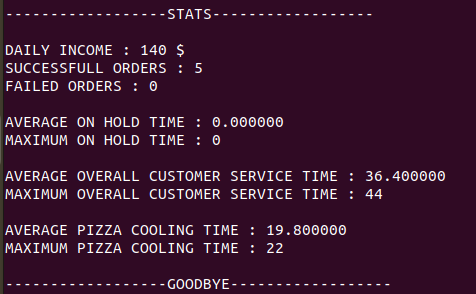
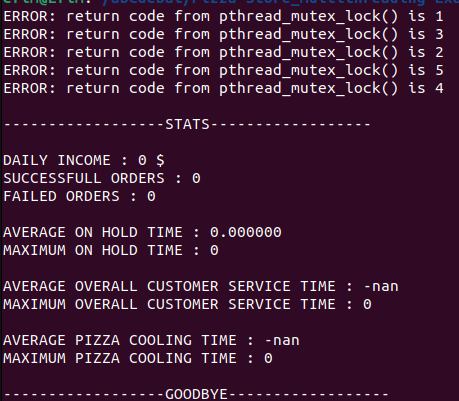
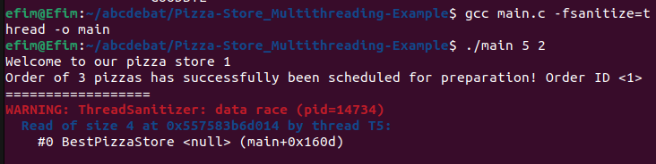

## Проект
Возьмем следующий [проект](https://github.com/kwsthsve/Pizza-Store_Multithreading-Example) с открытым исходным кодом на C. Он без элементов OpenMP, но при этом с элементами параллельного программирования.

## Задача
Проведем проверку данного кода на какие-либо ошибки парраллельного программирования. Для этого будут использованы инструменты Helgrind и ThreadSanitizer.

## Проверка
Стандартный запуск

    $ gcc main.c -o main
    $ ./main 5 2

Стандартный вывод (может изменяться в связи с внутренними вычислениями в некоторой степени зависящими от рандома)

Для начала попробуем запустить проекст с использованием ThreadSanitizer с помощью следующей команды

    $ gcc main.c -fsanitize=thread -o main
    $ ./main 5 2

После запуска стандартный вывод не изменился и никаких ошибок также не было, но программа стала работать сильно дольше. Проверим теперь с использованием Helgrind.

    $ gcc main.c -o main
    $ valgrind --tool=helgrind ./main 5 2

Ничего серьезного вновь получено не было, но при одновременной работе Helgrind и ThreadSanitizer возникали проблемы, поэтому их нужно было запускать отдельно.

Уберем первый попавшийся мьютекс (53, 97) для того, чтобы вызвать гонку данных и попробуем отследить ее с помощью наших инструментов. Для начала используем ThreadSanitizer и посмотрим на его сообщения. В этот раз можно заметить что автор кода предусмотрел возможные ошибки и сам инструмент ничего не сообщил, но вывод изменился. (но при этом запуск без ThreadSanitizer имеет стандартный вывод)
    

При использовании Helgrind вывод имел стандартный вид, но появились сообщения о возможной гонке данных следующего вида

    Possible data race during write of size 4 at 0x10D014 by thread #6    

Попробуем избавиться от проверки внутри кода, из-за которой ThreadSanitizer не может сработать. Для этого потребуется избавиться от строчек 66 - 69.
Теперь появились сообщения от ThreadSanitizer, указывающие на гонку данных.

Helgrind также выдал несколько сообщений о data race вида

    Possible data race during read of size 4 at 0x10D014 by thread #6

## Итог

Изначально проект по результатам проверки не выдал сообщений о возможных data race. Для этого мы внесkи некоторые изменения после которых появилась гонка данных. Запустили проверку еще раз и получили сообщение о data race, указывающий на ошибку. Но при этом Helgrind раньше сообщил о возможном data race, так как в связи с реализацией ThreadSanitazer не успевал сработать.

